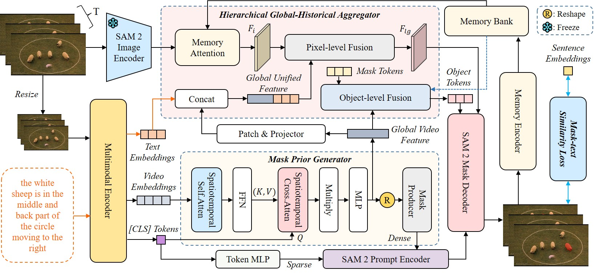

# MPG-SAM 2: Adapting SAM 2 with Mask Priors and Global Context for Referring Video Object Segmentation

Paper: [MPG-SAM 2](https://arxiv.org/abs/2501.13667)

Overview of MPG-SAM 2:



## News

[June 26th, 2025] 🔥MPG-SAM 2 has been accepted by ICCV 2025! We have open-sourced the code and model.

## Contents

- [Model](#model)
- [Installation](#installation)
- [Prepare](#prepare)
- [Training & Inference](#training & inference)
- [Acknowledgement](#acknowledgement)
- [Citation](#citation)

## Model

Our model can be obtained from this Hugging Face link [MPG-SAM 2 · HF](https://huggingface.co/ReeF2025/MPG-SAM2). The tiny model uses BEiT-3-base, while the other models use BEiT-3-large. "ytvos" refers to the model trained on the Ref-Youtube-VOS dataset, and "mevis" refers to the model trained on the MeViS dataset.

## Installation

```bash
git clone https://github.com/rongfu-dsb/MPG-SAM2.git
cd MPG-SAM2
conda create -n MPG-SAM2 python=3.8
conda activate MPG-SAM2
pip install torch==2.0.1 torchvision==0.15.2 torchaudio==2.0.2 --index-url https://download.pytorch.org/whl/cu118
pip install -r requirements.txt
pip install 'git+https://github.com/facebookresearch/fvcore' 
```

## Prepare

### Datasets

We mainly used the Ref-Youtube-VOS, Ref-DAVIS17, RefCOCO/+/g, and MeViS datasets. For the data preparation process, please refer to [ReferFormer](https://github.com/wjn922/ReferFormer) and [MeViS](https://github.com/henghuiding/MeViS). Once the data is prepared, replace `./your_data` in the code with the path to your dataset.

```
├── your_data
│   ├── coco
│   │   ├── refcoco
│   │   ├── refcoco+
│   │   ├── refcocog
│   │   └── train2014
│   ├── ref-youtube-vos
│   │   ├── meta_expressions
│   │   ├── train
│   │   └── valid
│   ├── ref-davis
│   │   ├── DAVIS
│   │   ├── davis_text_annotations
│   │   ├── meta_expressions
│   │   ├── train
│   │   └── valid
│   ├── mevis-release
│   │   ├── train
│   │   ├── valid
│   │   └── valid_u
```

### Initial weights

In this link [BEiT-3](https://github.com/microsoft/unilm/tree/master/beit3), download the weights for BEiT-3-large/BEiT-3-base and beit3.spm, and then replace `--encoder_pretrained` and `--version` accordingly. In this link [SAM2](https://github.com/facebookresearch/sam2), download the weights for sam2_hiera_large and replace `--vision_pretrained`.

## Training & Inference

##### Ref-Youtube-VOS

```bash
bash pre_fine.sh
```

##### Ref-DAVIS17

```
bash ./scripts/dist_test_davis.sh ./workdir_davis ./your_ytvos_weights --ngpu=1
```

The Ref-DAVIS17 dataset is not used for training; instead, the weights trained on the Ref-Youtube-VOS dataset are directly used for inference.

##### MeViS

```
bash finetune_mevis.sh
```

The inference results from the Ref-Youtube-VOS and MeViS datasets are submitted to servers [Ref-Youtube-VOS](https://codalab.lisn.upsaclay.fr/competitions/3282) and [MeViS](https://codalab.lisn.upsaclay.fr/competitions/15094) for metric evaluation, respectively.

## Acknowledgement

We borrow some code from the following works and would like to express our gratitude to them: [SAM2](https://github.com/facebookresearch/sam2), [EVF-SAM](https://github.com/hustvl/EVF-SAM), [ReferFormer](https://github.com/wjn922/ReferFormer), [BEiT-3](https://github.com/microsoft/unilm/tree/master/beit3).

## Citation

```
@article{rong2025mpg,
  title={MPG-SAM 2: Adapting SAM 2 with Mask Priors and Global Context for Referring Video Object Segmentation},
  author={Rong, Fu and Lan, Meng and Zhang, Qian and Zhang, Lefei},
  journal={arXiv preprint arXiv:2501.13667},
  year={2025}
}
```
